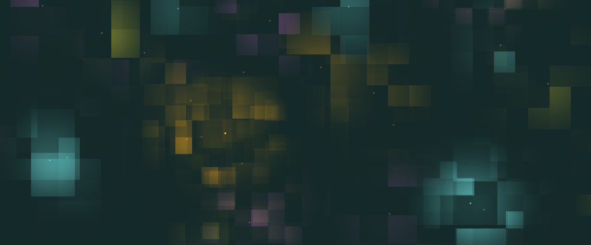
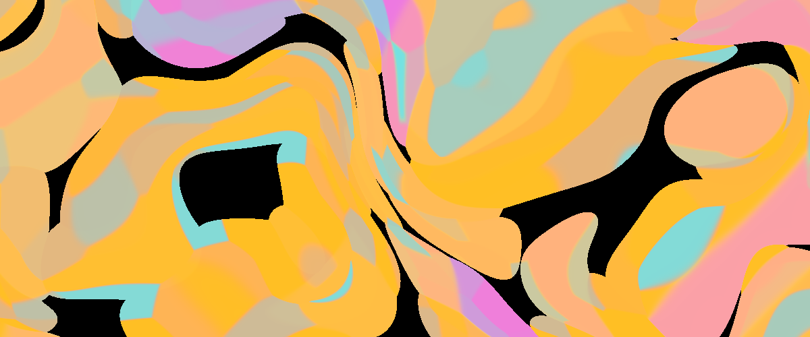
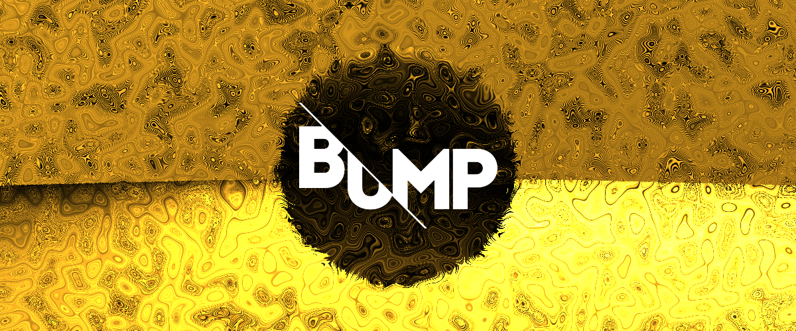
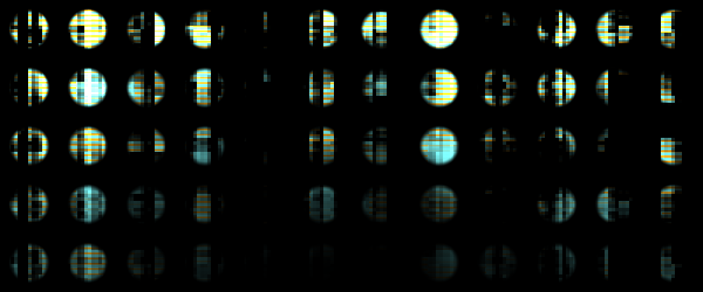
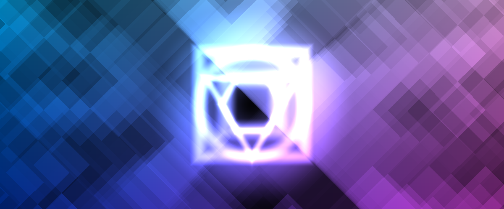
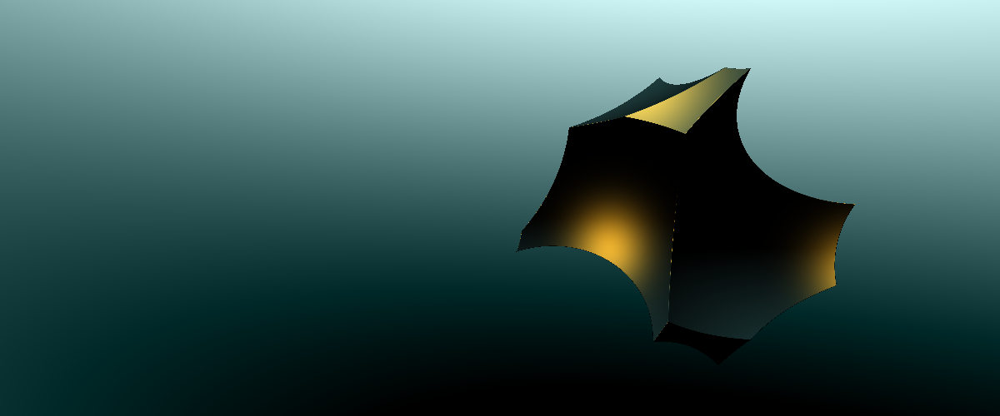
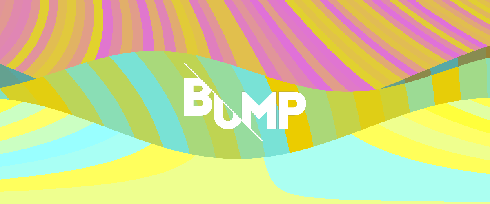

### BUMP visuals

the following is my contribution to a gig performed by [No computer](http://nocomputer.be/). it's a series of 2D shaders that will potentially be displayed on a big screen during the [Bump festival in Kortrijk on the 24th of june 2016](http://bump-festival.be/).
it is mostly hacked from the following shaders:

[https://www.shadertoy.com/view/MlXGDf](https://www.shadertoy.com/view/MlXGDf), [https://www.shadertoy.com/view/Xds3zN](https://www.shadertoy.com/view/Xds3zN) & [http://thebookofshaders.com/](http://thebookofshaders.com/)

the basic setup is a [Processing 3](https://processing.org/download/?processing) sketch with the following code:

    PShader shader;
    String name = "shader_name";

    void setup() {
      size( 1200, 500, P3D );
      noStroke();
      shader = loadShader( name + ".glsl");
    }

    void draw() {

      shader.set("u_resolution", float(width), float(height));
      shader.set("u_time", 1000 + millis() / 1000.0);

      shader(shader);
      rect(0,0,width,height);

    }

    void keyPressed(){
      shader = loadShader( name + ".glsl");
      saveFrame( name + ".png" );
    }

pressing any key will reload the shader an take a snapshot.
you can copy paste any of the following snippets (click editor to open the code)
click on the preview link to watch a live version.

<ul>
    <li>
        color blocks bright 
         
        <a href="http://player.thebookofshaders.com/?log=160620065714">preview</a> 
        <a href="http://thebookofshaders.com/edit.php?log=160620065457">editor</a>
         
    </li>
    <li>
        color blocks dark 
         
        <a href="http://player.thebookofshaders.com/?log=160620070406">preview</a> 
        <a href="http://thebookofshaders.com/edit.php?log=160620070339">editor</a>
         
    </li>
    <li>
        cone 
             
        <a href="http://player.thebookofshaders.com/?log=160620090418">preview</a> 
        <a href="http://thebookofshaders.com/edit.php?log=160620090347">editor</a>
         
    </li>
    <li>
        black box 
             
        <a href="http://player.thebookofshaders.com/?log=160620080832">preview</a> 
        <a href="http://thebookofshaders.com/edit.php?log=160620080758">editor</a>
         
    </li>
    <li>
        animated Chladni pattern 
         
        <a href="http://player.thebookofshaders.com/?log=160620071347">preview</a> 
        <a href="http://thebookofshaders.com/edit.php?log=160620071328">editor</a>
         
    </li>
    <li>
        gooey 
         
        <a href="http://player.thebookofshaders.com/?log=160620074649">preview</a> 
        <a href="http://thebookofshaders.com/edit.php?log=160620074633">editor</a>
         
    </li>
    <li>
        Klimt 
             
        <a href="http://player.thebookofshaders.com/?log=160620082246">preview</a> 
        <a href="http://thebookofshaders.com/edit.php?log=160620082232">editor</a>
         
    </li>
    <li>
        monolith 
             
        <a href="http://player.thebookofshaders.com/?log=160620092119">preview</a> 
        <a href="http://thebookofshaders.com/edit.php?log=160620092104">editor</a>
         
    </li>
    <li>
        panopticon 
         
        <a href="http://player.thebookofshaders.com/?log=160620072548">preview</a> 
        <a href="http://thebookofshaders.com/edit.php?log=160620072511">editor</a>
         
    </li>
    <li>
        polygons 
             
        <a href="http://player.thebookofshaders.com/?log=160620095646">preview</a> 
        <a href="http://thebookofshaders.com/edit.php?log=160620095628">editor</a>
         
    </li>
    <li>
        vorogrid 
             
        <a href="http://player.thebookofshaders.com/?log=160620100408">preview</a> 
        <a href="http://thebookofshaders.com/edit.php?log=160620100323">editor</a>
         
    </li>
    <li>
        waves 
             
        <a href="http://player.thebookofshaders.com/?log=160620093524">preview</a> 
        <a href="http://thebookofshaders.com/edit.php?log=160620093508">editor</a>
         
    </li>
</ul>

the code is not commented and not optimised at all, just putting it here for the sake of sharing.
not sure if any of those will make it to the big screen but it was fun to make :)
